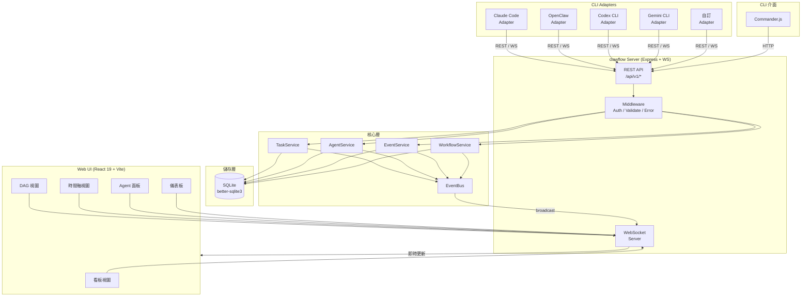
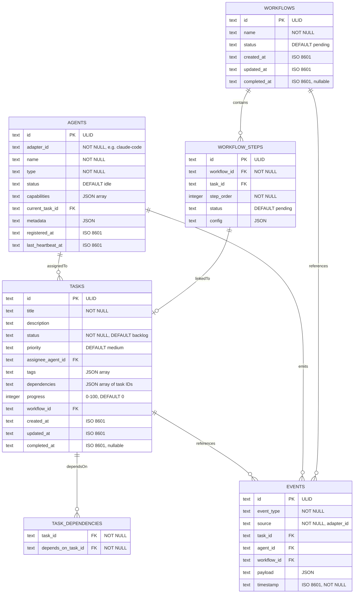
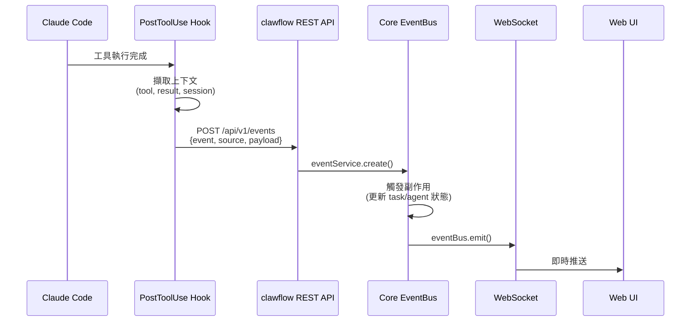
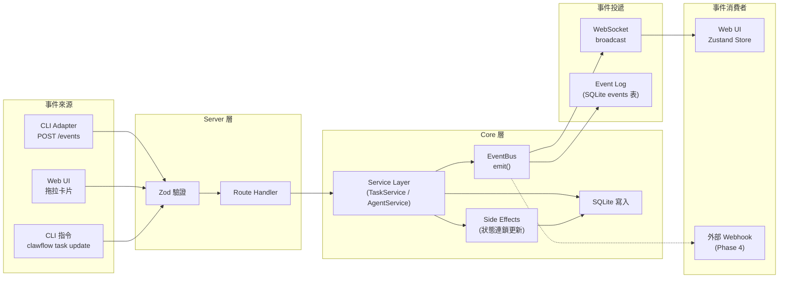
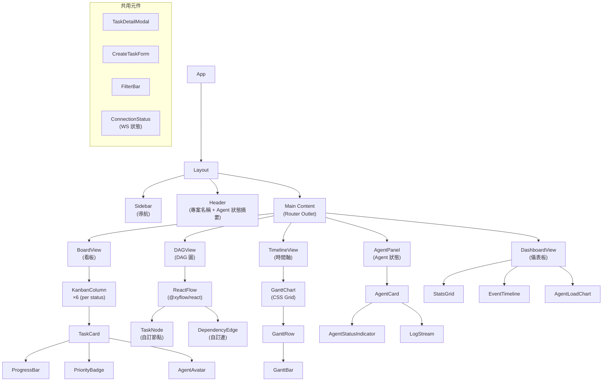
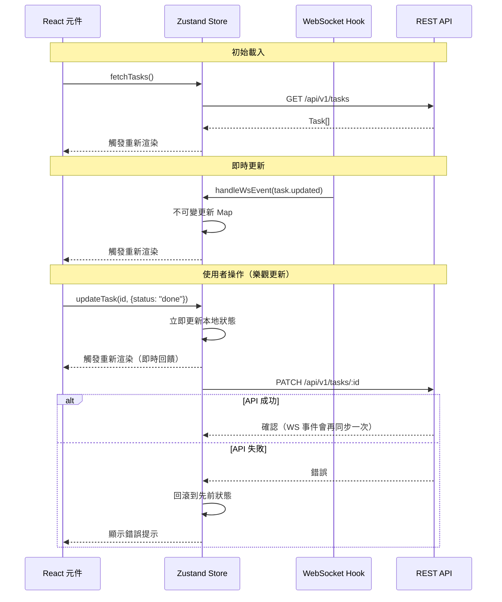
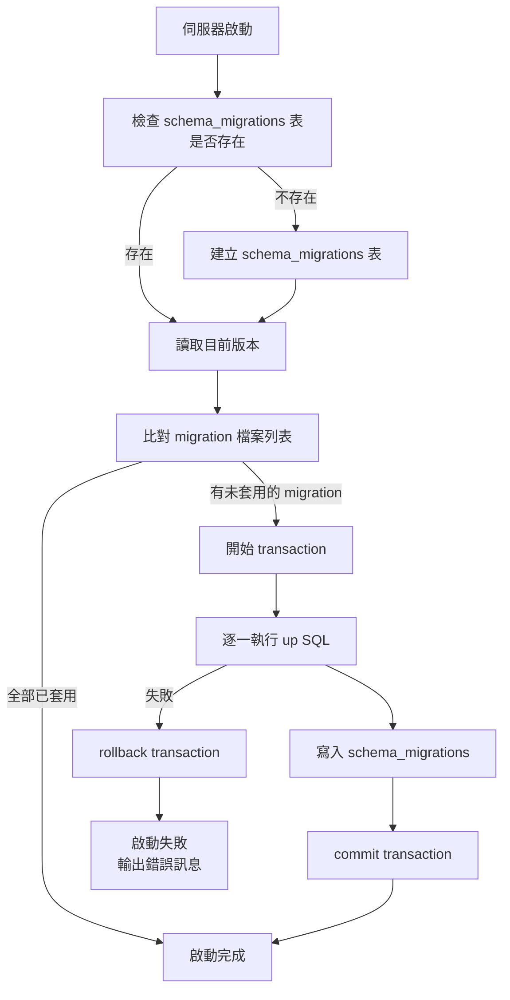

# clawflow — System Design Document (SDD)

## 版本資訊
- **版本**: v1.0.0-draft
- **日期**: 2026-04-07
- **作者**: CC (Claude Code)
- **狀態**: Phase 0 — 設計中
- **對應 PRD**: [00-task-spec.md](./00-task-spec.md)

---

## 1. 系統架構

### 1.1 架構總覽



### 1.2 分層設計

| 層 | 職責 | 技術 |
|----|------|------|
| **Adapter 層** | 將各 CLI 的原生事件轉譯為標準事件格式 | TypeScript 介面 + 各 CLI 專屬實作 |
| **Server 層** | HTTP/WS 端點、路由、中介層 | Express 5 + ws |
| **Core 層** | 業務邏輯、事件匯流排、狀態管理 | 純 TypeScript，無框架依賴 |
| **Storage 層** | 資料持久化、查詢、遷移 | better-sqlite3 |
| **Web UI 層** | 視覺化呈現、即時更新 | React 19 + Zustand + @xyflow/react |
| **CLI 層** | 命令列操作介面 | Commander.js |

### 1.3 設計原則

1. **零外部依賴部署** — SQLite 內嵌，`npx clawflow` 即可執行
2. **事件驅動** — 所有狀態變更透過 EventBus 廣播，前端 WS 訂閱
3. **Adapter 可插拔** — 標準介面 + 動態載入
4. **不可變資料流** — Core 層所有寫入操作回傳新物件，不修改傳入參數
5. **單一資料源** — SQLite 為唯一真實來源，記憶體快取僅用於效能優化

---

## 2. 資料模型

### 2.1 ER 圖



### 2.2 SQLite 表結構

#### tasks

```sql
CREATE TABLE tasks (
    id            TEXT PRIMARY KEY,
    title         TEXT NOT NULL,
    description   TEXT,
    status        TEXT NOT NULL DEFAULT 'backlog'
                  CHECK (status IN ('backlog','todo','in_progress','review','done','archived')),
    priority      TEXT NOT NULL DEFAULT 'medium'
                  CHECK (priority IN ('critical','high','medium','low')),
    assignee_agent_id TEXT REFERENCES agents(id) ON DELETE SET NULL,
    tags          TEXT DEFAULT '[]',          -- JSON array
    progress      INTEGER NOT NULL DEFAULT 0
                  CHECK (progress >= 0 AND progress <= 100),
    workflow_id   TEXT REFERENCES workflows(id) ON DELETE SET NULL,
    created_at    TEXT NOT NULL,
    updated_at    TEXT NOT NULL,
    completed_at  TEXT
);

CREATE INDEX idx_tasks_status ON tasks(status);
CREATE INDEX idx_tasks_assignee ON tasks(assignee_agent_id);
CREATE INDEX idx_tasks_workflow ON tasks(workflow_id);
```

#### task_dependencies

```sql
CREATE TABLE task_dependencies (
    task_id           TEXT NOT NULL REFERENCES tasks(id) ON DELETE CASCADE,
    depends_on_task_id TEXT NOT NULL REFERENCES tasks(id) ON DELETE CASCADE,
    PRIMARY KEY (task_id, depends_on_task_id),
    CHECK (task_id != depends_on_task_id)
);

CREATE INDEX idx_deps_task ON task_dependencies(task_id);
CREATE INDEX idx_deps_depends_on ON task_dependencies(depends_on_task_id);
```

#### agents

```sql
CREATE TABLE agents (
    id               TEXT PRIMARY KEY,
    adapter_id       TEXT NOT NULL,
    name             TEXT NOT NULL,
    type             TEXT NOT NULL,
    status           TEXT NOT NULL DEFAULT 'idle'
                     CHECK (status IN ('idle','working','completed','error')),
    capabilities     TEXT DEFAULT '[]',       -- JSON array
    current_task_id  TEXT REFERENCES tasks(id) ON DELETE SET NULL,
    metadata         TEXT DEFAULT '{}',       -- JSON object
    registered_at    TEXT NOT NULL,
    last_heartbeat_at TEXT NOT NULL
);

CREATE INDEX idx_agents_adapter ON agents(adapter_id);
CREATE INDEX idx_agents_status ON agents(status);
```

#### events

```sql
CREATE TABLE events (
    id          TEXT PRIMARY KEY,
    event_type  TEXT NOT NULL,
    source      TEXT NOT NULL,
    task_id     TEXT REFERENCES tasks(id) ON DELETE SET NULL,
    agent_id    TEXT REFERENCES agents(id) ON DELETE SET NULL,
    workflow_id TEXT REFERENCES workflows(id) ON DELETE SET NULL,
    payload     TEXT DEFAULT '{}',            -- JSON object
    timestamp   TEXT NOT NULL
);

CREATE INDEX idx_events_type ON events(event_type);
CREATE INDEX idx_events_source ON events(source);
CREATE INDEX idx_events_task ON events(task_id);
CREATE INDEX idx_events_agent ON events(agent_id);
CREATE INDEX idx_events_timestamp ON events(timestamp);
```

#### workflows

```sql
CREATE TABLE workflows (
    id           TEXT PRIMARY KEY,
    name         TEXT NOT NULL,
    status       TEXT NOT NULL DEFAULT 'pending'
                 CHECK (status IN ('pending','running','completed','failed','cancelled')),
    created_at   TEXT NOT NULL,
    updated_at   TEXT NOT NULL,
    completed_at TEXT
);
```

#### workflow_steps

```sql
CREATE TABLE workflow_steps (
    id           TEXT PRIMARY KEY,
    workflow_id  TEXT NOT NULL REFERENCES workflows(id) ON DELETE CASCADE,
    task_id      TEXT REFERENCES tasks(id) ON DELETE SET NULL,
    step_order   INTEGER NOT NULL,
    status       TEXT NOT NULL DEFAULT 'pending'
                 CHECK (status IN ('pending','running','completed','failed','skipped')),
    config       TEXT DEFAULT '{}',           -- JSON object
    UNIQUE(workflow_id, step_order)
);

CREATE INDEX idx_wf_steps_workflow ON workflow_steps(workflow_id);
```

#### schema_migrations

```sql
CREATE TABLE schema_migrations (
    version    INTEGER PRIMARY KEY,
    name       TEXT NOT NULL,
    applied_at TEXT NOT NULL
);
```

### 2.3 ID 策略

使用 **ULID**（Universally Unique Lexicographically Sortable Identifier）：
- 時間排序性：ULID 前 48 bits 為毫秒時間戳，自然按建立時間排序
- 唯一性：後 80 bits 為隨機數，碰撞機率極低
- 字串格式：26 字元 Crockford Base32，適合 SQLite TEXT 欄位
- 套件：`ulid` (npm)

---

## 3. API 設計

### 3.1 REST API

基礎路徑：`/api/v1`

#### 3.1.1 Tasks

| 方法 | 路徑 | 描述 | Request Body | Response |
|------|------|------|-------------|----------|
| GET | `/tasks` | 列出所有任務 | — | `Task[]` |
| GET | `/tasks/:id` | 取得單一任務 | — | `Task` |
| POST | `/tasks` | 建立任務 | `CreateTaskDto` | `Task` |
| PATCH | `/tasks/:id` | 更新任務 | `UpdateTaskDto` | `Task` |
| DELETE | `/tasks/:id` | 刪除任務 | — | `{ deleted: true }` |
| GET | `/tasks/:id/dependencies` | 取得任務依賴 | — | `Task[]` |
| POST | `/tasks/:id/dependencies` | 新增依賴 | `{ dependsOnTaskId }` | `TaskDependency` |
| DELETE | `/tasks/:id/dependencies/:depId` | 移除依賴 | — | `{ deleted: true }` |

**查詢參數**（GET `/tasks`）：

| 參數 | 型別 | 描述 |
|------|------|------|
| `status` | string | 篩選狀態（逗號分隔多選） |
| `priority` | string | 篩選優先級 |
| `assignee` | string | 篩選指派 agent |
| `workflowId` | string | 篩選所屬 workflow |
| `tag` | string | 篩選標籤（逗號分隔） |
| `sort` | string | 排序欄位，預設 `created_at` |
| `order` | `asc` \| `desc` | 排序方向，預設 `desc` |
| `limit` | number | 分頁大小，預設 50，上限 200 |
| `offset` | number | 分頁偏移，預設 0 |

#### 3.1.2 Agents

| 方法 | 路徑 | 描述 | Request Body | Response |
|------|------|------|-------------|----------|
| GET | `/agents` | 列出所有 agents | — | `Agent[]` |
| GET | `/agents/:id` | 取得單一 agent | — | `Agent` |
| POST | `/agents/register` | 註冊 agent | `RegisterAgentDto` | `Agent` |
| PATCH | `/agents/:id` | 更新 agent 狀態 | `UpdateAgentDto` | `Agent` |
| DELETE | `/agents/:id` | 取消註冊 | — | `{ deleted: true }` |
| POST | `/agents/:id/heartbeat` | 心跳更新 | `{ timestamp? }` | `{ ok: true }` |

#### 3.1.3 Events

| 方法 | 路徑 | 描述 | Request Body | Response |
|------|------|------|-------------|----------|
| GET | `/events` | 列出事件 | — | `Event[]` |
| POST | `/events` | 提交事件（Adapter 主要入口） | `StandardEvent` | `Event` |
| POST | `/events/batch` | 批量提交事件 | `StandardEvent[]` | `Event[]` |

**查詢參數**（GET `/events`）：

| 參數 | 型別 | 描述 |
|------|------|------|
| `type` | string | 事件類型篩選 |
| `source` | string | 來源 adapter 篩選 |
| `taskId` | string | 關聯任務篩選 |
| `agentId` | string | 關聯 agent 篩選 |
| `since` | string | 起始時間（ISO 8601） |
| `until` | string | 結束時間（ISO 8601） |
| `limit` | number | 分頁大小，預設 100 |
| `offset` | number | 分頁偏移 |

#### 3.1.4 Workflows

| 方法 | 路徑 | 描述 | Request Body | Response |
|------|------|------|-------------|----------|
| GET | `/workflows` | 列出 workflows | — | `Workflow[]` |
| GET | `/workflows/:id` | 取得含 steps 的 workflow | — | `WorkflowDetail` |
| POST | `/workflows` | 建立 workflow | `CreateWorkflowDto` | `Workflow` |
| PATCH | `/workflows/:id` | 更新 workflow | `UpdateWorkflowDto` | `Workflow` |
| DELETE | `/workflows/:id` | 刪除 workflow | — | `{ deleted: true }` |

#### 3.1.5 系統

| 方法 | 路徑 | 描述 |
|------|------|------|
| GET | `/health` | 健康檢查 |
| GET | `/stats` | 儀表板統計（任務完成率、agent 負載等） |
| POST | `/export` | 匯出全部資料為 JSON |
| POST | `/import` | 匯入 JSON 資料 |

### 3.2 DTO / Schema 定義（Zod）

```typescript
// === Task DTOs ===

const CreateTaskDto = z.object({
  title: z.string().min(1).max(500),
  description: z.string().max(5000).optional(),
  status: z.enum(['backlog', 'todo', 'in_progress', 'review', 'done', 'archived']).default('backlog'),
  priority: z.enum(['critical', 'high', 'medium', 'low']).default('medium'),
  assigneeAgentId: z.string().optional(),
  tags: z.array(z.string().max(50)).max(20).default([]),
  dependencies: z.array(z.string()).default([]),
  workflowId: z.string().optional(),
});

const UpdateTaskDto = z.object({
  title: z.string().min(1).max(500).optional(),
  description: z.string().max(5000).optional(),
  status: z.enum(['backlog', 'todo', 'in_progress', 'review', 'done', 'archived']).optional(),
  priority: z.enum(['critical', 'high', 'medium', 'low']).optional(),
  assigneeAgentId: z.string().nullable().optional(),
  tags: z.array(z.string().max(50)).max(20).optional(),
  progress: z.number().int().min(0).max(100).optional(),
});

// === Agent DTOs ===

const RegisterAgentDto = z.object({
  adapterId: z.string().min(1),
  name: z.string().min(1).max(200),
  type: z.string().min(1),
  capabilities: z.array(z.string()).default([]),
  metadata: z.record(z.unknown()).default({}),
});

const UpdateAgentDto = z.object({
  status: z.enum(['idle', 'working', 'completed', 'error']).optional(),
  currentTaskId: z.string().nullable().optional(),
  metadata: z.record(z.unknown()).optional(),
});

// === Event DTOs ===

const StandardEventDto = z.object({
  event: z.string().min(1),
  source: z.string().min(1),
  timestamp: z.string().datetime().optional(),  // 自動填入
  payload: z.record(z.unknown()).default({}),
});
```

### 3.3 API 回應格式

所有 API 回應使用統一信封格式：

```typescript
// 成功回應
interface ApiResponse<T> {
  success: true;
  data: T;
  meta?: {
    total?: number;
    limit?: number;
    offset?: number;
  };
}

// 錯誤回應
interface ApiErrorResponse {
  success: false;
  error: {
    code: string;        // e.g. "TASK_NOT_FOUND"
    message: string;     // 人類可讀訊息
    details?: unknown;   // zod 驗證錯誤等附加資訊
  };
}
```

**HTTP 狀態碼對照**：

| 狀態碼 | 場景 |
|--------|------|
| 200 | 成功（GET / PATCH / DELETE） |
| 201 | 建立成功（POST） |
| 400 | 請求格式錯誤 / 驗證失敗 |
| 401 | 未授權（啟用 auth-token 時） |
| 404 | 資源不存在 |
| 409 | 衝突（如循環依賴） |
| 422 | 業務邏輯錯誤（如 DAG 違反） |
| 500 | 伺服器內部錯誤 |

### 3.4 WebSocket 協議

#### 連線端點

```
ws://localhost:3700/ws
```

#### 連線參數

| 參數 | 描述 |
|------|------|
| `token` | 可選，Auth token（若啟用認證） |
| `subscribe` | 可選，訂閱過濾（如 `task.*,agent.*`） |

#### 訊息格式

**Server → Client（事件推送）**：

```typescript
interface WsMessage {
  type: 'event';
  data: {
    event: string;       // 事件類型
    source: string;      // 來源
    timestamp: string;   // ISO 8601
    payload: Record<string, unknown>;
  };
}
```

**Client → Server（訂閱管理）**：

```typescript
// 訂閱特定事件
interface WsSubscribe {
  type: 'subscribe';
  events: string[];      // e.g. ["task.*", "agent.claude-code.*"]
}

// 取消訂閱
interface WsUnsubscribe {
  type: 'unsubscribe';
  events: string[];
}

// Ping（保活）
interface WsPing {
  type: 'ping';
}
```

**Server → Client（控制訊息）**：

```typescript
// 連線確認
interface WsConnected {
  type: 'connected';
  sessionId: string;
}

// Pong
interface WsPong {
  type: 'pong';
}

// 錯誤
interface WsError {
  type: 'error';
  code: string;
  message: string;
}
```

#### 事件類型定義

```typescript
type EventType =
  // 任務事件
  | 'task.created'
  | 'task.updated'
  | 'task.completed'
  | 'task.failed'
  | 'task.deleted'
  // Agent 事件
  | 'agent.registered'
  | 'agent.started'
  | 'agent.progress'
  | 'agent.completed'
  | 'agent.error'
  | 'agent.heartbeat'
  // Workflow 事件
  | 'workflow.started'
  | 'workflow.step'
  | 'workflow.completed'
  | 'workflow.failed';
```

#### 事件通配符

支援 glob 風格訂閱：
- `task.*` — 所有任務事件
- `agent.claude-code.*` — 特定 adapter 的 agent 事件
- `*` — 所有事件（預設）

---

## 4. Adapter 介面設計

### 4.1 介面定義

```typescript
// src/adapters/types.ts

/**
 * 標準化事件，所有 adapter 轉譯後的統一格式
 */
interface StandardEvent {
  event: EventType;
  source: string;           // adapter id
  timestamp: string;        // ISO 8601
  payload: Record<string, unknown>;
}

/**
 * Adapter 命令（雙向控制用，可選）
 */
interface AdapterCommand {
  type: string;
  target: string;           // agent id 或 task id
  params: Record<string, unknown>;
}

/**
 * Adapter 配置
 */
interface AdapterConfig {
  enabled: boolean;
  options: Record<string, unknown>;
}

/**
 * CLI Adapter 介面
 * 所有 adapter 必須實作此介面
 */
interface CLIAdapter {
  /** 唯一識別碼，如 "claude-code" */
  readonly id: string;
  /** 顯示名稱，如 "Claude Code" */
  readonly name: string;
  /** Adapter 版本 */
  readonly version: string;

  /**
   * 初始化並連線
   * @param config - Adapter 專屬配置
   * @param eventSink - 事件推送目標（呼叫此函式將事件送入核心層）
   */
  connect(config: AdapterConfig, eventSink: EventSink): Promise<void>;

  /**
   * 斷線並清理資源
   */
  disconnect(): Promise<void>;

  /**
   * 將原生事件轉譯為標準事件
   * @param rawEvent - 來自 CLI 的原始事件資料
   * @returns 標準化事件，若無法轉譯回傳 null
   */
  translateEvent(rawEvent: unknown): StandardEvent | null;

  /**
   * 發送指令到 CLI（可選，用於雙向控制）
   */
  sendCommand?(command: AdapterCommand): Promise<void>;

  /**
   * 健康檢查
   */
  healthCheck(): Promise<AdapterHealthStatus>;
}

type EventSink = (event: StandardEvent) => void;

interface AdapterHealthStatus {
  healthy: boolean;
  message?: string;
  lastEventAt?: string;
}
```

### 4.2 Adapter 註冊機制

```typescript
// src/adapters/registry.ts

/**
 * Adapter 註冊表
 * 管理所有已載入的 adapter 實例
 */
interface AdapterRegistry {
  /** 註冊 adapter */
  register(adapter: CLIAdapter): void;

  /** 取消註冊 */
  unregister(adapterId: string): void;

  /** 取得 adapter */
  get(adapterId: string): CLIAdapter | undefined;

  /** 列出所有 adapter */
  list(): ReadonlyArray<CLIAdapter>;

  /** 啟動所有已註冊的 adapter */
  connectAll(eventSink: EventSink): Promise<void>;

  /** 斷開所有 adapter */
  disconnectAll(): Promise<void>;

  /** 全部健康檢查 */
  healthCheckAll(): Promise<Record<string, AdapterHealthStatus>>;
}
```

### 4.3 Claude Code Adapter（Phase 1 實作）

Claude Code 透過 **Hooks** 機制（PostToolUse）將事件推送到 clawflow：



**Hook 腳本設計**：

```bash
#!/bin/bash
# ~/.claude/hooks/post-tool-use.sh
# Claude Code PostToolUse hook → clawflow 事件推送

CLAWFLOW_URL="${CLAWFLOW_URL:-http://localhost:3700}"
CLAWFLOW_TOKEN="${CLAWFLOW_TOKEN:-}"

# 從 stdin 讀取 hook payload
PAYLOAD=$(cat)

# 轉譯為 clawflow 標準事件
EVENT=$(echo "$PAYLOAD" | jq '{
  event: "agent.progress",
  source: "claude-code",
  timestamp: (now | todate),
  payload: {
    tool: .tool_name,
    result: .tool_result,
    session: .session_id
  }
}')

# 推送到 clawflow
HEADERS=(-H "Content-Type: application/json")
if [ -n "$CLAWFLOW_TOKEN" ]; then
  HEADERS+=(-H "Authorization: Bearer $CLAWFLOW_TOKEN")
fi

curl -s -X POST "${CLAWFLOW_URL}/api/v1/events" \
  "${HEADERS[@]}" \
  -d "$EVENT" > /dev/null 2>&1 &
```

### 4.4 Adapter 開發流程

第三方開發者建立新 adapter 的步驟：

1. 實作 `CLIAdapter` 介面
2. 在 `translateEvent` 中定義原生事件 → 標準事件的映射邏輯
3. 在 `connect` 中建立與目標 CLI 的通訊（如 WebSocket 訂閱、輪詢等）
4. 將 adapter 註冊到 `AdapterRegistry`
5. 撰寫單元測試（至少覆蓋 `translateEvent` 所有分支）

---

## 5. 事件流設計

### 5.1 完整事件流



### 5.2 EventBus 設計

```typescript
// src/core/events/event-bus.ts

type EventHandler = (event: StandardEvent) => void | Promise<void>;

interface EventBus {
  /**
   * 訂閱事件
   * @param pattern - 事件類型或通配符（如 "task.*"）
   * @param handler - 事件處理器
   * @returns 取消訂閱函式
   */
  on(pattern: string, handler: EventHandler): () => void;

  /**
   * 單次訂閱
   */
  once(pattern: string, handler: EventHandler): () => void;

  /**
   * 發射事件
   * @param event - 標準事件
   */
  emit(event: StandardEvent): void;

  /**
   * 取得訂閱者數量
   */
  listenerCount(pattern?: string): number;

  /**
   * 清除所有訂閱
   */
  removeAllListeners(): void;
}
```

### 5.3 Side Effects（連鎖副作用）

當事件觸發時，Core 層自動執行的連鎖更新：

| 觸發事件 | 副作用 |
|----------|--------|
| `task.updated(status=done)` | 將 `progress` 設為 100，設定 `completed_at` |
| `task.updated(status=done)` | 檢查依賴此任務的其他任務，若所有依賴已完成則可排程 |
| `task.updated(status=in_progress)` | 驗證所有 `dependsOn` 任務已為 `done` |
| `agent.started` | 更新 agent `status=working`，設定 `current_task_id` |
| `agent.completed` | 更新 agent `status=idle`，清除 `current_task_id` |
| `agent.error` | 更新 agent `status=error`，標記相關 task 為 `review` 待處理 |
| `agent.heartbeat` | 更新 `last_heartbeat_at` |
| `workflow.step(completed)` | 檢查是否有下一步，自動推進或標記 workflow 完成 |

### 5.4 DAG 依賴驗證

```typescript
// src/core/services/dag-validator.ts

interface DAGValidator {
  /**
   * 驗證新增依賴是否會造成循環
   * 使用 DFS 偵測迴路
   * @returns true 表示安全（無循環），false 表示有循環
   */
  validateNoCycle(taskId: string, newDependencyId: string): boolean;

  /**
   * 取得拓撲排序
   * @returns 排序後的 task ID 陣列，無法排序時拋出 CyclicDependencyError
   */
  topologicalSort(taskIds: string[]): string[];

  /**
   * 檢查任務是否可被執行（所有依賴已完成）
   */
  isExecutable(taskId: string): boolean;
}
```

---

## 6. 前端元件架構

### 6.1 元件樹



### 6.2 Zustand Store 設計

```typescript
// src/web/stores/task-store.ts

interface TaskState {
  /** 所有任務，以 id 為 key 的 Map */
  tasks: ReadonlyMap<string, Task>;
  /** 目前選中的任務 ID */
  selectedTaskId: string | null;
  /** 篩選條件 */
  filters: TaskFilters;
  /** 載入狀態 */
  loading: boolean;
  /** 錯誤訊息 */
  error: string | null;
}

interface TaskActions {
  /** 從 API 取得所有任務 */
  fetchTasks(): Promise<void>;
  /** 建立任務 */
  createTask(dto: CreateTaskDto): Promise<Task>;
  /** 更新任務（樂觀更新 + API 同步） */
  updateTask(id: string, dto: UpdateTaskDto): Promise<void>;
  /** 刪除任務 */
  deleteTask(id: string): Promise<void>;
  /** 選擇任務 */
  selectTask(id: string | null): void;
  /** 設定篩選 */
  setFilters(filters: Partial<TaskFilters>): void;
  /** 從 WebSocket 事件更新（即時同步） */
  handleWsEvent(event: StandardEvent): void;
}

// src/web/stores/agent-store.ts

interface AgentState {
  agents: ReadonlyMap<string, Agent>;
  /** Agent 日誌快取（最新 100 筆 per agent） */
  logs: ReadonlyMap<string, ReadonlyArray<LogEntry>>;
}

interface AgentActions {
  fetchAgents(): Promise<void>;
  handleWsEvent(event: StandardEvent): void;
}

// src/web/stores/ws-store.ts

interface WsState {
  /** 連線狀態 */
  status: 'connecting' | 'connected' | 'disconnected' | 'error';
  /** 重連次數 */
  reconnectCount: number;
  /** 最後收到訊息時間 */
  lastMessageAt: string | null;
}

interface WsActions {
  connect(url: string): void;
  disconnect(): void;
  subscribe(events: string[]): void;
  unsubscribe(events: string[]): void;
}

// src/web/stores/workflow-store.ts

interface WorkflowState {
  workflows: ReadonlyMap<string, Workflow>;
  selectedWorkflowId: string | null;
}

interface WorkflowActions {
  fetchWorkflows(): Promise<void>;
  handleWsEvent(event: StandardEvent): void;
}
```

### 6.3 即時更新策略



### 6.4 WebSocket Hook

```typescript
// src/web/hooks/useWebSocket.ts

/**
 * WebSocket 連線 hook
 * 自動連線、斷線重連、心跳保活
 */
function useWebSocket(url: string): {
  status: WsState['status'];
  reconnectCount: number;
};

// 重連策略：指數退避
// 第 1 次：1 秒
// 第 2 次：2 秒
// 第 3 次：4 秒
// ...
// 上限：30 秒
// 最大重連次數：20 次

// 心跳間隔：30 秒
// 心跳超時：10 秒（無 pong 回應則判定斷線）
```

### 6.5 路由設計

| 路徑 | 元件 | 描述 |
|------|------|------|
| `/` | `DashboardView` | 儀表板首頁 |
| `/board` | `BoardView` | 看板視圖 |
| `/dag` | `DAGView` | DAG 依賴圖 |
| `/timeline` | `TimelineView` | 時間軸 / 甘特圖 |
| `/agents` | `AgentPanel` | Agent 狀態面板 |
| `/agents/:id` | `AgentDetail` | Agent 詳情 + 日誌 |

---

## 7. 安全設計

### 7.1 認證

clawflow 預設**無認證**（本地開發工具），但支援可選的 Token 認證：

```bash
# 啟用 token 認證
clawflow start --auth-token "my-secret-token"
```

認證機制：
- REST API：`Authorization: Bearer <token>` Header
- WebSocket：連線時 `?token=<token>` 查詢參數
- 驗證邏輯集中在 `authMiddleware`

```typescript
// src/server/middleware/auth.ts

function authMiddleware(config: ServerConfig) {
  return (req: Request, res: Response, next: NextFunction) => {
    if (!config.authToken) {
      // 未設定 token，跳過認證
      return next();
    }

    const token = req.headers.authorization?.replace('Bearer ', '');
    if (token !== config.authToken) {
      return res.status(401).json({
        success: false,
        error: { code: 'UNAUTHORIZED', message: '無效的認證 token' }
      });
    }
    next();
  };
}
```

### 7.2 輸入驗證

所有 API 端點使用 Zod schema 驗證：

```typescript
// src/server/middleware/validate.ts

function validateBody<T>(schema: ZodSchema<T>) {
  return (req: Request, res: Response, next: NextFunction) => {
    const result = schema.safeParse(req.body);
    if (!result.success) {
      return res.status(400).json({
        success: false,
        error: {
          code: 'VALIDATION_ERROR',
          message: '請求格式不正確',
          details: result.error.flatten(),
        }
      });
    }
    req.body = result.data;  // 使用驗證後的資料（已去除多餘欄位）
    next();
  };
}
```

### 7.3 SQLite 安全

| 措施 | 說明 |
|------|------|
| 參數化查詢 | 所有 SQL 使用 `?` placeholder，禁止字串拼接 |
| 檔案權限 | 建立 DB 檔案時設定 `0600`（僅 owner 讀寫） |
| WAL 模式 | 啟用 WAL（Write-Ahead Logging）提升併發讀取效能 |
| 備份安全 | `export` 指令僅匯出資料，不包含 DB 內部結構 |

### 7.4 WebSocket 安全

| 措施 | 說明 |
|------|------|
| 連線數限制 | 預設最大 50 個同時連線 |
| 訊息大小限制 | 單一訊息最大 1MB |
| 頻率限制 | 每個連線每秒最多 100 則訊息 |
| Origin 檢查 | 生產模式啟用 origin 白名單 |

### 7.5 安全檢查清單

- [ ] 無硬編碼 secret
- [ ] 所有使用者輸入經 Zod 驗證
- [ ] SQL 使用參數化查詢
- [ ] 錯誤訊息不洩漏內部資訊
- [ ] DB 檔案權限 600
- [ ] WebSocket 連線數 / 訊息頻率限制

---

## 8. 錯誤處理策略

### 8.1 錯誤分類

```typescript
// src/core/errors.ts

/** 基礎業務錯誤 */
class ClawflowError extends Error {
  constructor(
    public readonly code: string,
    message: string,
    public readonly httpStatus: number = 500,
    public readonly details?: unknown,
  ) {
    super(message);
    this.name = 'ClawflowError';
  }
}

/** 資源不存在 */
class NotFoundError extends ClawflowError {
  constructor(resource: string, id: string) {
    super('NOT_FOUND', `${resource} 不存在: ${id}`, 404);
  }
}

/** 驗證錯誤 */
class ValidationError extends ClawflowError {
  constructor(message: string, details?: unknown) {
    super('VALIDATION_ERROR', message, 400, details);
  }
}

/** 循環依賴 */
class CyclicDependencyError extends ClawflowError {
  constructor(taskId: string, dependencyId: string) {
    super(
      'CYCLIC_DEPENDENCY',
      `新增依賴會造成循環: ${taskId} → ${dependencyId}`,
      409,
    );
  }
}

/** 依賴未完成 */
class DependencyNotMetError extends ClawflowError {
  constructor(taskId: string, unmetDeps: string[]) {
    super(
      'DEPENDENCY_NOT_MET',
      `任務 ${taskId} 有未完成的依賴: ${unmetDeps.join(', ')}`,
      422,
    );
  }
}
```

### 8.2 全域錯誤處理中介層

```typescript
// src/server/middleware/error-handler.ts

function errorHandler(err: Error, req: Request, res: Response, next: NextFunction) {
  if (err instanceof ClawflowError) {
    return res.status(err.httpStatus).json({
      success: false,
      error: {
        code: err.code,
        message: err.message,
        details: err.details,
      },
    });
  }

  // 未預期錯誤 — 記錄完整堆疊，回傳安全訊息
  console.error('[UnhandledError]', err);
  return res.status(500).json({
    success: false,
    error: {
      code: 'INTERNAL_ERROR',
      message: '伺服器內部錯誤',
    },
  });
}
```

### 8.3 各層錯誤處理策略

| 層 | 策略 |
|----|------|
| **Adapter 層** | 捕獲所有異常，轉為 `agent.error` 事件推送，不中斷其他 adapter |
| **Server 層** | Zod 驗證攔截 → 400；全域 errorHandler 兜底 |
| **Core 層** | 業務錯誤拋出 `ClawflowError` 子類別；DB 操作用 try-catch 包裝 |
| **WebSocket 層** | 訊息解析失敗 → 回傳 WsError；連線異常 → 觸發重連 |
| **前端** | API 呼叫失敗 → Store 記錄錯誤 + Toast 通知；WS 斷線 → 自動重連 + 狀態指示器 |

### 8.4 Adapter 容錯

```typescript
// Adapter 連線失敗不影響整體服務
async function connectAdapterSafely(adapter: CLIAdapter, config: AdapterConfig, sink: EventSink) {
  try {
    await adapter.connect(config, sink);
    console.log(`[Adapter] ${adapter.id} 連線成功`);
  } catch (err) {
    console.error(`[Adapter] ${adapter.id} 連線失敗:`, err);
    // 不拋出，讓其他 adapter 繼續運作
    // 排程重連（指數退避）
    scheduleReconnect(adapter, config, sink);
  }
}
```

---

## 9. 資料庫 Migration 策略

### 9.1 Migration 框架

不使用 ORM migration 框架，自建輕量級 migration 機制：

```typescript
// src/core/db/migrator.ts

interface Migration {
  /** 版本號（遞增整數） */
  version: number;
  /** 名稱（描述用途） */
  name: string;
  /** 升版 SQL */
  up: string;
  /** 降版 SQL（可選，用於 rollback） */
  down?: string;
}

interface Migrator {
  /**
   * 執行所有未套用的 migration
   * 在 transaction 中逐一執行，任一失敗則 rollback
   */
  migrate(): void;

  /**
   * 回滾到指定版本
   */
  rollbackTo(version: number): void;

  /**
   * 取得目前版本
   */
  currentVersion(): number;

  /**
   * 列出所有 migration 及其套用狀態
   */
  status(): MigrationStatus[];
}
```

### 9.2 Migration 檔案結構

```
src/core/db/migrations/
├── 001_initial_schema.ts
├── 002_add_workflow_tables.ts
└── ...
```

每個 migration 檔案：

```typescript
// src/core/db/migrations/001_initial_schema.ts

import { Migration } from '../migrator';

export const migration: Migration = {
  version: 1,
  name: 'initial_schema',
  up: `
    CREATE TABLE tasks ( ... );
    CREATE TABLE task_dependencies ( ... );
    CREATE TABLE agents ( ... );
    CREATE TABLE events ( ... );
    -- 索引 ...
  `,
  down: `
    DROP TABLE IF EXISTS events;
    DROP TABLE IF EXISTS agents;
    DROP TABLE IF EXISTS task_dependencies;
    DROP TABLE IF EXISTS tasks;
  `,
};
```

### 9.3 執行流程



### 9.4 Migration 規則

1. **只新增，不修改** — 已發布的 migration 不得修改，只能新增
2. **向後相容** — 新 migration 不得破壞現有資料
3. **Transaction 包裝** — 每次 migration 在 transaction 中執行
4. **啟動時自動執行** — 伺服器啟動時自動套用所有未執行的 migration
5. **版本號遞增** — 使用三位數整數序號（001, 002, ...）

### 9.5 資料備份

```typescript
// 匯出時包含 migration 版本號
interface ExportData {
  version: number;        // 當前 schema 版本
  exportedAt: string;     // ISO 8601
  tasks: Task[];
  agents: Agent[];
  workflows: Workflow[];
  events: Event[];        // 可選，預設不匯出（量大）
}

// 匯入時驗證版本相容性
// 若匯入資料版本 > 當前版本 → 拒絕（需先升級）
// 若匯入資料版本 < 當前版本 → 自動轉換
```

---

## 10. 目錄結構對應

根據 PRD 定義的專案結構，各設計區塊的檔案對應：

```
src/
├── core/
│   ├── db/
│   │   ├── database.ts           # DB 連線管理（WAL、PRAGMA 設定）
│   │   ├── migrator.ts           # Migration 引擎
│   │   └── migrations/
│   │       ├── 001_initial_schema.ts
│   │       └── index.ts          # Migration 註冊表
│   ├── models/
│   │   ├── task.ts               # Task 型別 + zod schema
│   │   ├── agent.ts              # Agent 型別 + zod schema
│   │   ├── event.ts              # Event 型別 + zod schema
│   │   └── workflow.ts           # Workflow 型別 + zod schema
│   ├── services/
│   │   ├── task-service.ts       # Task CRUD + 依賴管理
│   │   ├── agent-service.ts      # Agent 註冊 + 狀態管理
│   │   ├── event-service.ts      # 事件收集 + 查詢
│   │   ├── workflow-service.ts   # Workflow 管理
│   │   └── dag-validator.ts      # DAG 循環偵測 + 拓撲排序
│   ├── events/
│   │   ├── event-bus.ts          # EventBus 實作
│   │   └── side-effects.ts       # 事件副作用處理器
│   └── errors.ts                 # 錯誤類別定義
├── server/
│   ├── index.ts                  # Express app 建立 + 啟動
│   ├── routes/
│   │   ├── task-routes.ts
│   │   ├── agent-routes.ts
│   │   ├── event-routes.ts
│   │   ├── workflow-routes.ts
│   │   └── system-routes.ts      # health, stats, export, import
│   ├── ws/
│   │   ├── ws-server.ts          # WebSocket 伺服器
│   │   └── ws-handler.ts         # 訊息解析 + 訂閱管理
│   └── middleware/
│       ├── auth.ts               # Token 認證
│       ├── validate.ts           # Zod 驗證中介層
│       └── error-handler.ts      # 全域錯誤處理
├── adapters/
│   ├── types.ts                  # CLIAdapter 介面定義
│   ├── registry.ts               # Adapter 註冊表
│   └── claude-code/
│       ├── index.ts              # Claude Code adapter 實作
│       └── hook-script.sh        # PostToolUse hook 腳本
├── cli/
│   └── index.ts                  # Commander.js CLI 進入點
└── web/
    ├── main.tsx                  # React 進入點
    ├── App.tsx                   # 根元件 + Router
    ├── components/
    │   ├── layout/
    │   │   ├── Layout.tsx
    │   │   ├── Sidebar.tsx
    │   │   └── Header.tsx
    │   ├── task/
    │   │   ├── TaskCard.tsx
    │   │   ├── TaskDetailModal.tsx
    │   │   ├── CreateTaskForm.tsx
    │   │   ├── ProgressBar.tsx
    │   │   └── PriorityBadge.tsx
    │   ├── agent/
    │   │   ├── AgentCard.tsx
    │   │   ├── AgentAvatar.tsx
    │   │   └── LogStream.tsx
    │   ├── dag/
    │   │   ├── TaskNode.tsx
    │   │   └── DependencyEdge.tsx
    │   ├── timeline/
    │   │   ├── GanttChart.tsx
    │   │   ├── GanttRow.tsx
    │   │   └── GanttBar.tsx
    │   └── shared/
    │       ├── FilterBar.tsx
    │       └── ConnectionStatus.tsx
    ├── views/
    │   ├── BoardView.tsx
    │   ├── DAGView.tsx
    │   ├── TimelineView.tsx
    │   ├── AgentPanel.tsx
    │   ├── AgentDetail.tsx
    │   └── DashboardView.tsx
    ├── hooks/
    │   ├── useWebSocket.ts
    │   └── useApi.ts
    ├── stores/
    │   ├── task-store.ts
    │   ├── agent-store.ts
    │   ├── workflow-store.ts
    │   └── ws-store.ts
    └── styles/
        └── index.css             # Tailwind 入口
```

---

## 11. 技術決策紀錄

| 決策 | 選擇 | 替代方案 | 理由 |
|------|------|----------|------|
| ID 格式 | ULID | UUID v4 / nanoid | 時間排序性 + 唯一性，適合事件流 |
| DB 模式 | WAL | DELETE (預設) | 讀寫並行效能好，適合 WS 即時推送場景 |
| 狀態管理 | Zustand | Redux / Jotai | 輕量、零 boilerplate、TypeScript 友好 |
| DAG 渲染 | @xyflow/react | D3.js / vis.js | 內建節點互動、縮放平移、React 原生整合 |
| 甘特圖 | CSS Grid 自製 | gantt-chart 套件 | 避免引入重依賴，需求簡單 |
| API 驗證 | Zod | Joi / ajv | TypeScript 型別推導、DSL 簡潔 |
| WS 庫 | ws | socket.io | 輕量、無魔法、協議標準 |
| Migration | 自製 | Drizzle / Knex | 配合 better-sqlite3 同步 API，依賴最少 |
